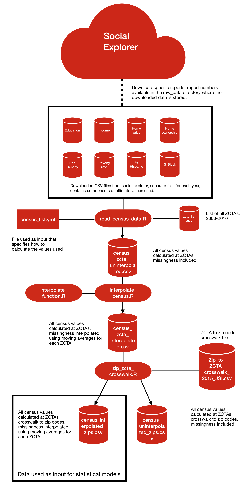

Census Confounder Pipeline
================
Ben Sabath
June 09, 2020

This directory contains a pipeline to produce a dataset with demographic
information from the US Census and American Community Survey at the
zipcode level.

## Raw Data

All source data is in the `raw_data` directory. The data was downloaded
from the census social explorer website by Fei Carnes. All downloaded
data is contained in the directory `raw_data/raw_census`. The data
within that directory is stored with the structure `<variable>/<census
or acs>/zcta/<year>`. In that directory is the csv and readme downloaded
from the Social explorer. To reacquire the source data, the same report
number should be downloaded from social explorer.

Additionally in this directory we have a list of all zctas (`zcta_list`)
and a crosswalk going from zctas to zip code
(`Zip_to_ZCTA_crosswalk_2015_JSI.csv`)

## Code

All code is stored in the `code` directory.

The file `make.R` can be executed to recreate the processing steps that
created cenesus\_interpolated\_zips.csv

In brief, the steps are as follows:

1st: The variables which are spread out across multiple files are
combined in to a single file. The layout files and the varibles within
them are indicated in `census_list.yml`. `read_census_data.R` is the
code which creates the initial dataset. As the source is US census data,
data points are located at zctas rather than zipcodes. Years without
assosciated files are included as missing data.

2nd: Temporal interpolation is performed. interpolate\_census.R performs
this operation using functions from interpolate\_function.R. A moving
average is calculated within each zcta and used to fill in the missing
years. See the ImputeTS for more details on the algorithm. Any rows that
still have missing data (implying no data was available for the
particular zcta) are discarded (around 200 zipcodes were discarded).

3rd: A crosswalk file is used to link the zctas in the dataset to
zipcodes. This is done by zip\_zcta\_crosswalk.R

Data was available for the year 2000, and from 2011-2016. All other
years were interpolated.

## Census Pipeline Output

The diriectory `processed_data` is left empty as the final products of
the census pipeline are larger than Github’s file size limit. However
running the `make.R` file in the `code` directory will recreate the
final products. The files created will be the following:

  - census\_zcta\_uninterpolated.csv: Demographic values calculated at
    the zcta level, includes missingness
  - census\_zcta\_interpolated.csv: Demographic values calculated at the
    zcta level, with missing values replaced by a moving average model
    for each ZCTA.
  - census\_uninterpolated\_zips.csv: Demographic values crosswalked
    from the zcta level to zip codes, includes missingness
  - census\_interpolated\_zips.csv: Demographic values crosswalked from
    zcta to zip codes, with missing values replaced by a moving average
    model for each ZCTA.

Variables in the output data set:

poverty: % of the population older than 65 below the poverty line
popdensity: population density per square mile medianhousevalue: median
value of owner occupied properties pct\_blk: % of the population listed
as black medhouseholdincome: median household income pct\_owner\_occ: %
of housing units occupied by their owner hispanic: % of the population
identified as hispanic, regardless of reported race education: % of the
population older than 65 not graduating from high school

Within this dataset there are ~38,000 unique zipcodes. There are around
47,000 unqiue zipcodes in the unmerged medicare mortality dataset. This
difference has been attributed to out of date and incorrect zipcodes
entered in to the medicare dataset as the standard list of zipcodes
nationally provided by ESRI only contains ~41,000 zipcodes. When merging
with the confounder data, ~0.2% of the medicare data will be lost. This
accounts to a loss of a similar proportion of individuals within the
data.

## Diagram of the workflow

