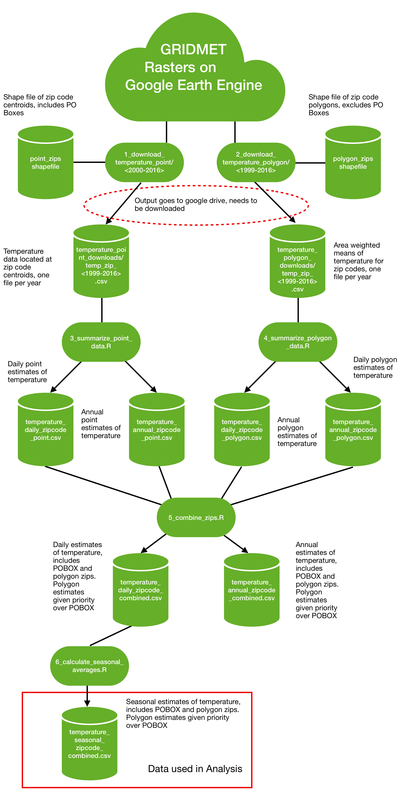

Temperature, Humidity, Precipitation Earth Engine Data
================
Ben Sabath
June 16, 2021

## Data Provided

We provide a zipped version of the point shape files that need to be
uploaded to Google earth engine, and a link the to polygon zip codes
used can be found [here](https://developers.google.com/earth-engine/).
The scripts provided that run on Google earth engine acquire the
temperature data that is aggregated by the rest of our scripts.

## Summary

The temperature and humidity data is sourced from the [University of
Idaho’s GRIDMET
project](https://developers.google.com/earth-engine/datasets/catalog/IDAHO_EPSCOR_GRIDMET).
We access it using Google Earth Engine, where it is available as daily
4km x 4km rasters from January 1st, 2000 until the present.

To recreate the pipeline to get the GRIDMET temperature data from Google
Earth Engine there are two major steps. The first step involves using
Google Earth Engine to aggregate the source data (splitting up the data
into multiple files so that it can all be processed) to the zip code
level and downloading the data. In the second step, we combine the
downloaded files in to large single files and calculate seasonal and
annual averages.

## Download steps

First, upload zip code shape files to Google Earth Engine, we used the
zip code centroids and polygons from ESRI for this. We provide the shape
files we use for centroids, but the polygon shape file is too large to
provide. The set of Zip code polygons provided by ESRI can be found
[here](https://www.arcgis.com/home/item.html?id=8d2012a2016e484dafaac0451f9aea24).

Google Earth Engine’s documentation is available
[here](https://developers.google.com/earth-engine/), and covers in
detail how to set up/run operations on their service.

In summary, each of the code files contained in
`code/1_download_temperature_point` and
`code/2_download_temperature_polygon` should be executed in the code
editor of Google earth engine. Someone attempting to reproduce this
analysis will need to adjust the code loading in the uploaded shape
files to point to their instance of that data.

Google Earth Engine doesn’t provide a means for direct download, so the
final output files are exported to Google Drive. They then must be
individually downloaded and stored in a directory before proceeding with
the next step. The files in the directories
`code/1_download_temperature_point` and `code/2_download
temperature_polygon` contain the code used to calculate daily zip code
level temperature estimates on Google earth engine and prepare those
data for export to Google drive.

## Software Versions

Please Note that the Earth Engine Platform is a proprietary service of
Google and to our knowledge does not make past versions available. We
used it in April 2019.

  - R base: 3.5.1
  - data.table = 1.14
  - lubridate = 1.7.10

## Combining the files

First, we combine the daily files for each year for each zip code
geography (`code/3_summarize_point_data.R`,
`code/summarize_polygon_data.T`) in to a single file. We also separately
calculate annual averages for each zip code at this time. The polygon
zip code file only includes zip codes with non-zero area, resulting in
around 8,000 fewer zip codes listed in that data set. To resolve this
issue, we create a combined file (`code/5_combine_zips.R`)where we use
the centroid zip code estimate for all zip codes not present in the
polygon estimate. We do this for both the daily and annual estimates.
These combined data sets are the ones that we ultimately use in our
studies, and use to calculate the seasonal averages
(`code/6_calculate_seasonal_averages`)used in our study as well.

## Output Temperature Data

This directory should contain the output of the entire earth engine
pipeline. Due to Github’s storage constraints, we only include the
annual data and the seasonal data ultimately used in the final analysis
here. All data covers the period from Jan 1, 2000 to April 30th, 2020.

Those two data sets are as follows:

  - `temperature_seasonal_zipcode_combined.csv`: Winter and summer mean
    daily max temperature and max relative humidity for all zip codes.
    Polygons are used to define zip code areas for area weighted means
    where possible, otherwise centroid estimates are used.

  - `temperature_annual_zipcode_combined.csv`: Annual mean daily max
    temperature, precipitation, and humidity for all zip codes. Polygons
    are used to define zip code areas for area weighted means where
    possible, otherwise centroid estimates are used.

Additional data produced by the pipeline is as follows:

  - `temperature_annual_zipcode_centroid.csv`: Annual mean temperature,
    precipitation, and humidity for all zip codes. The max temperature
    at the zip code centroid is used.

  - `temperature_annual_zipcode_polygon.csv`: Annual mean daily max
    temperature, precipitation, and humidity for all zip codes. Area
    weighted means of the max temperature are used. Zip codes without
    defined polygons are excluded from this data set.

  - `temperature_daily_zipcode_centroid.csv`: Daily max temperature
    values. The max temperature at the zip code centroid is used.

  - `temperature_daily_zipcode_combined.csv`: Daily max temperature
    values. Polygons are used to define zip code areas for area weighted
    means where possible, otherwise centroid estimates are used.

  - `temperature_daily_zipcode_polygon.csv`: Daily max temperature
    values. Area weighted means of the max temperature are used. Zip
    codes without defined polygons are excluded from this data set.

## Variables

#### Annual/daily Data

  - `ZIP`: Zip Code
  - `year`: year
  - `tmmx`: Daily max temperature
  - `rmax`: Daily max relative humidity
  - `pr`: Daily total precipitation

#### Seasonal Data

  - `ZIP`: Zip code
  - `year`: year
  - `summer_tmmx`: Mean summer daily max temperature
  - `summer_rmax`: Mean summer daily max relative humidity
  - `winter_tmmx`: Mean winter daily max temperature
  - `winter_rmax`: Mean winter daily max relative humidity

## Diagram of workflow

